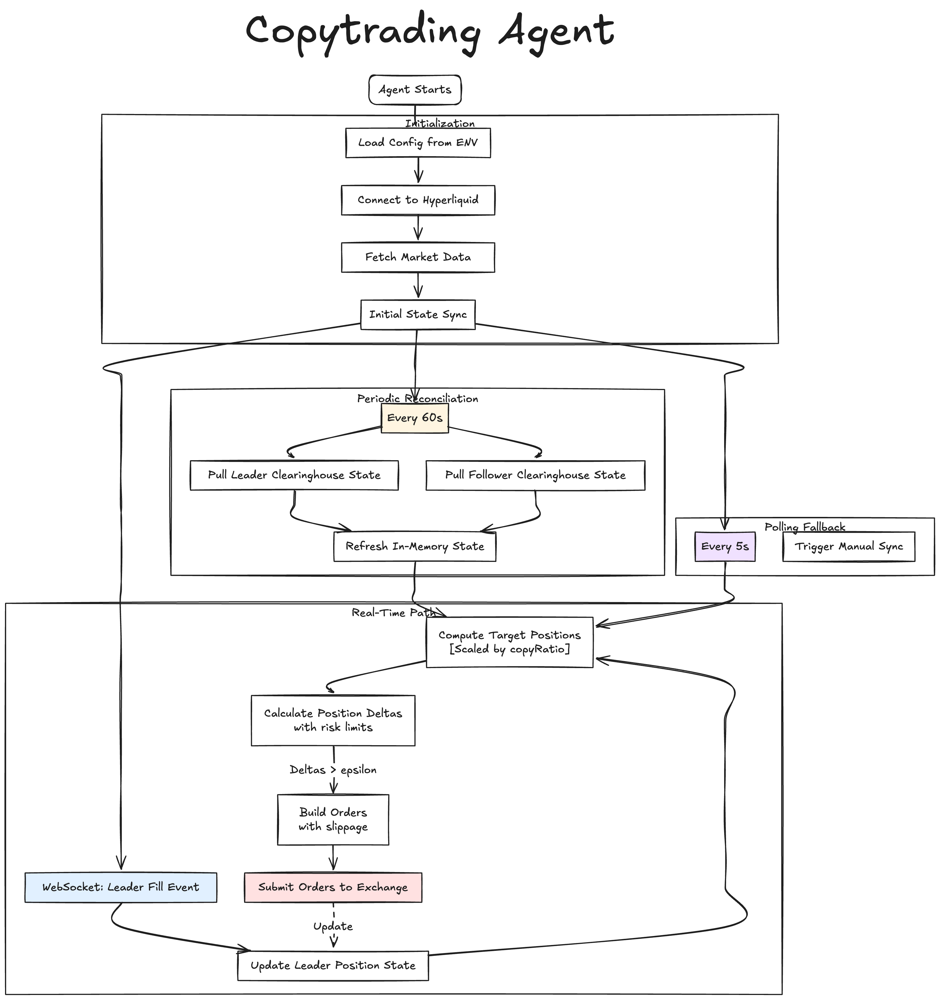

# Copy Trading Agent

Automated copy trading agent that mirrors a leader account's positions onto your own wallet with configurable risk controls. The agent listens for the leader's fills, derives target exposure per market, and places IOC limit orders to sync the follower account while enforcing leverage, notional, and slippage caps.

## Supported Exchanges

- [x] **Hyperliquid** — Full support (WebSocket + HTTP API)
- [ ] **Lighter** — Planned
- [ ] **Aster** — Planned

## System Flow



## Features
- WebSocket subscription to leader fills with automatic reconnection.
- Periodic reconciliation against on-chain `clearinghouseState` snapshots.
- Risk-aware position sizing via copy ratio, leverage, notional, and slippage limits.
- Shared state engine for leader/follower positions and account metrics.
- Optional vault routing: point the follower at a vault and orders will append the vault address automatically.
- TypeScript codebase with typed Hyperliquid SDK integration.

## Setup
1. Install dependencies:
   ```bash
   npm install
   ```
2. Copy the sample environment and fill in your keys:
   ```bash
   cp examples/.env.example .env
   ```
   - `LEADER_ADDRESS`: wallet you want to mirror.
   - `FOLLOWER_PRIVATE_KEY`: private key for your follower API wallet.
   - `FOLLOWER_VAULT_ADDRESS` (optional): set if your follower trades through a vault instead of the base account.
   - Adjust risk knobs (`COPY_RATIO`, `MAX_LEVERAGE`, etc.) as needed.
3. Build the project:
   ```bash
   npm run build
   ```
4. Run the daemon:
   ```bash
   npm start
   ```
   For quick iteration you can use `npm run dev`, which runs the TypeScript entrypoint directly via `ts-node`.

## Docker

Build the image and run with a bind-mounted `.env` file:

```bash
docker build -t copytrading-agent .
docker run --rm \
  --name copytrading-agent \
  -v $(pwd)/.env:/app/.env:ro \
  copytrading-agent
```

Alternatively, set envs via `--env-file` (dotenv in the app also loads .env if present):

```bash
docker run --rm \
  --env-file ./.env \
  copytrading-agent
```

## Testing
- No automated tests are bundled yet. Add your own checks or dry-run on Hyperliquid testnet before risking capital.

## Project Layout
- `src/index.ts` — entrypoint wiring transports, subscriptions, reconciliation loop, and trade executor.
- `src/config` — environment loading and risk configuration.
- `src/clients` — Hyperliquid SDK client/transport factories.
- `src/domain` — shared trader state logic plus leader/follower specializations.
- `src/services` — subscriptions, market metadata, reconciler, and order executor.
- `examples/.env.example` — reference environment variables.

## Notes
- The repo uses ESM modules (`"type": "module"`); Node 20+ is recommended.
- Network access and trading actions happen against the URLs defined in the Hyperliquid SDK transports. Set `HYPERLIQUID_ENVIRONMENT=testnet` to dry-run safely.
